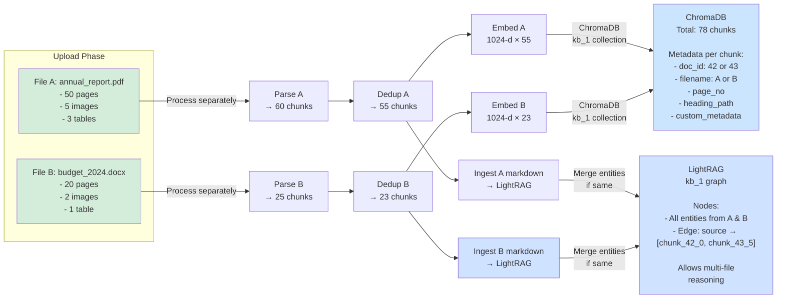

# Mermaid Flowchart - NexusRAG PDF Processing Pipeline

```mermaid
graph TD
    Start["👤 User Uploads PDF<br/>(text + image + table)"]
    Start -->|POST /documents/upload<br/>{workspace_id}| UploadAPI["🔵 Upload API Endpoint<br/>- Validate file type<br/>- Check size ≤ 50MB<br/>- Save to: uploads/uuid.pdf<br/>- Create Document record<br/>  status=PENDING"]

    UploadAPI -->|Return immediately| Response["HTTP 200<br/>document_id: 42<br/>status: PENDING"]
    Response --> Wait["📊 Background Job Queued<br/>process_document_background(42,<br/>file_path)"]

    Wait --> FetchWS["🔧 Fetch Workspace KG Settings<br/>from PostgreSQL"]
    FetchWS --> UpdateParsing["Update doc status<br/>→ PARSING"]

    UpdateParsing --> Docling["🟢 PHASE 1: DOCLING PARSING<br/>━━━━━━━━━━━━━━━━━━━<br/><br/>File: uploads/uuid.pdf"]

    Docling --> DoclingConverter["📄 Docling DocumentConverter<br/>Options:<br/>- generate_picture_images: true<br/>- do_ocr: true<br/>- do_formula_enrichment: true<br/>- ocr_engine: auto<br/><br/>✓ Extract structure<br/>✓ Extract text<br/>✓ Extract images (PIL)<br/>✓ Extract tables (Markdown)"]

    DoclingConverter --> ImgCaption["🖼️ Image Extraction<br/>for each image:<br/>1. Save as PNG<br/>2. Generate caption<br/>   via Vision LLM<br/>   (Gemini/Ollama)<br/><br/>Input Image →<br/>Output: 'Chart showing<br/>Q1-Q4 revenue trend'"]

    DoclingConverter --> TableCaption["📊 Table Extraction<br/>for each table:<br/>1. Extract Markdown<br/>2. Generate caption<br/>   via LLM<br/><br/>Input Table →<br/>Output: 'Revenue by<br/>region Q1-Q4'"]

    ImgCaption --> MarkdownExport["📝 Export to Markdown<br/>- Full text with headings<br/>- Image references: <br/>- Table markdown syntax"]

    TableCaption --> MarkdownExport

    MarkdownExport --> HybridChunk["✂️ HybridChunker<br/>Semantic + Structural Chunking<br/><br/>Config:<br/>- max_tokens: 512<br/>- merge_peers: true<br/>- chunk_overlap: 50<br/><br/>Output: 85 chunks<br/>(from original ~100)"]

    HybridChunk --> ChunkAugment["🔗 Augment Chunks<br/>Add to each chunk:<br/>- Image captions<br/>- Table summaries<br/>- Heading paths<br/><br/>chunk_text after augment:<br/>'Q1 revenue $100M...<br/>[Image: Chart...]<br/>[Table: Revenue...]'"]

    ChunkAugment --> Dedup["🧹 Phase 1.5: DEDUPLICATION<br/><br/>Input: 85 chunks<br/>Process:<br/>- Exact match detection<br/>- Near-duplicate (similarity)<br/>- Noise filtering<br/>Output: 75 unique chunks"]

    Dedup --> UpdateIndexing["Update doc status<br/>→ INDEXING"]

    UpdateIndexing --> Index["🟡 PHASE 2: INDEXING<br/>━━━━━━━━━━━━━━━━━<br/>Parallel: Vector + KG"]

    Index --> Embedding["⚡ A. EMBEDDING SERVICE<br/><br/>Model: BAAI/bge-m3<br/>Dimension: 1024<br/>Batch size: 32<br/><br/>Input 75 chunks →<br/>Output: 75 × 1024-dim vectors<br/>(normalized)"]

    Index --> KGIngest["🧠 B. KG INGEST (LightRAG)<br/><br/>Input: Full markdown"]

    Embedding --> ChromaDB["💾 ChromaDB: Add Docs<br/><br/>Per chunk:<br/>- id: doc_42_chunk_N<br/>- embedding: 1024-dim vec<br/>- document: chunk text<br/>- metadata:<br/>  • document_id<br/>  • page_no<br/>  • heading_path<br/>  • has_table: true/false<br/>  • image_refs: [img_1,...]<br/>  • table_refs: [tbl_1,...]<br/>  • custom_metadata<br/><br/>Collection: kb_{workspace_id}<br/>Store: 75 docs"]

    KGIngest --> KGProcess["LLM Entity Extraction<br/>Entity types:<br/>- PERSON<br/>- ORG<br/>- PRODUCT<br/>- LOCATION<br/>- FINANCIAL_METRIC<br/>- DATE<br/>- TECHNOLOGY<br/><br/>LLM Relation Extraction<br/>Build graph:<br/>- Nodes: entities<br/>- Edges: relationships<br/>- Back-ref: entity → chunks"]

    KGProcess --> KGEmbed["Embed Entities<br/>Provider:<br/>- Gemini (3072-d)<br/>- Ollama (varies)<br/>- sentence-transformers (1024-d)<br/><br/>Store: NetworkX + NanoVectorDB<br/>Location: data/lightrag/kb_1/"]

    ChromaDB --> SaveImages["💾 Save Images to FileSystem<br/><br/>Location: data/docling/kb_1/images/<br/>- img_001.png<br/>- img_002.png<br/>- ...<br/><br/>Also save to DB:<br/>DocumentImage table:<br/>- image_id<br/>- page_no<br/>- caption<br/>- file_path"]

    KGEmbed --> SaveMetadata["💾 Save Metadata to PostgreSQL<br/><br/>Document:<br/>- status: INDEXED ✓<br/>- chunk_count: 75<br/>- page_count: 50<br/>- image_count: 3<br/>- table_count: 2<br/>- markdown_content<br/>- processing_time_ms<br/>- parser_version<br/><br/>DocumentImage (3 rows)<br/>DocumentTable (2 rows)<br/>DocumentChunk (metadata link)"]

    SaveImages --> Complete["✅ PHASE 3: INDEXED<br/>Status update: INDEXED<br/>Ready for querying!"]

    SaveMetadata --> Complete

    Complete --> UserReady["✅ User sees in UI:<br/>- Document listed<br/>- Status: INDEXED ✓<br/>- 75 chunks<br/>- 3 images<br/>- 2 tables<br/>- Ready to query"]

    UserReady --> Query["👤 User Question:<br/>'Q1 revenue tăng<br/>bao nhiêu?'"]

    Query --> VectorSearch["🔍 Vector Search (ChromaDB)<br/><br/>1. Embed question: 1024-dim<br/>2. Cosine similarity<br/>3. Over-fetch top-20<br/>4. With metadata filter"]

    Query --> KGSearch["🧠 KG Query (LightRAG)<br/><br/>1. Parse entities:<br/>   Revenue, Q1, $<br/>2. Multi-hop retrieval<br/>3. Find connected chunks"]

    VectorSearch --> Merge["🔄 Merge Candidates<br/><br/>Vec results + KG results<br/>→ Dedup by chunk_id<br/>→ ~30-40 unique chunks"]

    KGSearch --> Merge

    Merge --> Rerank["🎯 Cross-Encoder Reranker<br/>Model: BAAI/bge-reranker-v2-m3<br/><br/>Score (query, chunk) jointly<br/>- chunk_0: 0.92 ✓<br/>- chunk_1: 0.87 ✓<br/>- chunk_2: 0.65 ✓<br/>- chunk_3: 0.45 ✗<br/>- ...<br/><br/>Top-K=8, filter ≥ 0.15"]

    Rerank --> Threshold["Filter by threshold<br/>Relevance ≥ 0.15<br/>Fallback: top-3 if all low"]

    Threshold --> Retrieved["📦 Retrieved Context<br/>(Top 8 chunks)<br/><br/>[chunk_0]: page 5, 0.92<br/>'Q1 revenue $100M,<br/>up 15% from Q4'<br/>Image: Chart...<br/><br/>[chunk_1]: page 12, 0.87<br/>'APAC: $50M (↑20%)'<br/>Table: Revenue..."]

    Retrieved --> Prompt["🎨 Prompt Assembly<br/><br/>System: 'You are analyst...'<br/>History: [prev messages]<br/>Citations: '[a3z1] ... [b7w2] ...'<br/>Question: 'Q1 revenue...?'<br/><br/>Directive:<br/>'Cite sources. Max 3/sentence.<br/>Use only provided context.'"]

    Prompt --> LLM["🤖 LLM Generation (Streaming)<br/><br/>Provider: Gemini/Ollama<br/>Model: gemini-2.5-flash<br/>Thinking: medium (if enabled)<br/>Streaming: SSE 15s keepalive"]

    LLM --> Think["💭 Extended Thinking<br/>(Optional)<br/><br/>Think level: minimal/low/medium/high<br/>Output: internal reasoning<br/>Display: collapsible panel"]

    Think --> Generate["📝 Generate Answer<br/><br/>Output (streaming):<br/>'Q1 revenue tăng 15%<br/>từ Q4 [a3z1]. Chi tiết:<br/>- APAC: $50M (↑20%) [b7w2]<br/>- EMEA: $30M (↑10%) [b7w2]'"]

    Generate --> PostGen["📌 Post-Generation<br/><br/>- Build citation cards<br/>  {id: a3z1, source: annual_report,<br/>   page: 5, relevance: 0.92}<br/>- Link image/table refs<br/>- Save to chat history<br/>- Attach analytics"]

    PostGen --> Frontend["🎯 Frontend Display<br/><br/>Answer + inline citations:<br/'Q1 revenue tăng 15% [a3z1]'<br/><br/>Hover [a3z1] →<br/>Show source card<br/><br/>Click [a3z1] →<br/>Jump to document viewer<br/><br/>Show chart + table<br/>below answer"]

    Frontend --> End["✅ Complete"]

    style Start fill:#e1f5e1
    style UploadAPI fill:#cce5ff
    style Response fill:#fff3cd
    style Wait fill:#fff3cd
    style Docling fill:#d4edda
    style Index fill:#fff3cd
    style ChromaDB fill:#cce5ff
    style SaveMetadata fill:#cce5ff
    style Complete fill:#d4edda
    style VectorSearch fill:#f8d7da
    style Rerank fill:#cfe2ff
    style Retrieved fill:#cfe2ff
    style Generate fill:#d4edda
    style End fill:#d4edda
```

---

## 📌 Huyền Thoại Màu Sắc

- 🟢 **Green**: Completed phases
- 🔵 **Blue**: Data storage/processing
- 🟡 **Yellow**: Async operations
- 🟠 **Orange**: Retrieval pipeline
- ⚫ **Red/Pink**: Cross-encoding + ranking

---

## ⚙️ Chi Tiết Cấu Hình

### Cấu hình Parser

| Config                             | Mặc định  | Ý nghĩa                     |
| ---------------------------------- | --------- | --------------------------- |
| `NEXUSRAG_DOCUMENT_PARSER`         | `docling` | Parser: docling hoặc marker |
| `NEXUSRAG_ENABLE_IMAGE_EXTRACTION` | `true`    | Trích images từ PDF         |
| `NEXUSRAG_ENABLE_IMAGE_CAPTIONING` | `true`    | Caption images via LLM      |
| `NEXUSRAG_ENABLE_TABLE_CAPTIONING` | `true`    | Caption tables via LLM      |
| `NEXUSRAG_ENABLE_OCR`              | `true`    | OCR cho scanned PDFs        |
| `NEXUSRAG_CHUNK_MAX_TOKENS`        | `512`     | Max tokens per chunk        |
| `NEXUSRAG_CHUNK_OVERLAP`           | `50`      | Overlap giữa chunks         |

### Cấu hình Retrieval

| Config                     | Mặc định                  | Ý nghĩa                     |
| -------------------------- | ------------------------- | --------------------------- |
| `NEXUSRAG_EMBEDDING_MODEL` | `BAAI/bge-m3`             | Embedding model (1024-d)    |
| `NEXUSRAG_RERANKER_MODEL`  | `BAAI/bge-reranker-v2-m3` | Cross-encoder reranker      |
| `NEXUSRAG_VECTOR_PREFETCH` | `20`                      | Over-fetch trước reranking  |
| `NEXUSRAG_RERANKER_TOP_K`  | `8`                       | Final results sau reranking |
| `NEXUSRAG_ENABLE_KG`       | `true`                    | Enable Knowledge Graph      |

### Cấu hình KG

| Config                   | Mặc định             | Ý nghĩa                                           |
| ------------------------ | -------------------- | ------------------------------------------------- |
| `NEXUSRAG_KG_LANGUAGE`   | `Vietnamese`         | Entity extraction language                        |
| `KG_EMBEDDING_PROVIDER`  | `gemini`             | KG embedding: gemini/ollama/sentence_transformers |
| `KG_EMBEDDING_MODEL`     | `text-embedding-004` | KG embedding model                                |
| `KG_EMBEDDING_DIMENSION` | `3072`               | KG embedding dimension                            |

---

## 🎯 Sơ Đồ Chi Tiết Kỳ 2: Multi-File Handling



---

## ❓ FAQ: Tại Sao Không Loạn?

### Q1: Giả sử annual_report nói doanh thu là $100M, nhưng budget nói là $110M?

**A**:

```
LLM sẽ:
1. Thấy 2 sources khác nhau
2. Citation enforcement: phải cite cả 2
3. Output: "annual_report: $100M [a3z1],
           budget: $110M [b7w2]"
4. User rõ ràng thấy mâu thuẫn → tự clarify
```

### Q2: Nếu user query không scope (không chọn file)?

**A**:

```
Query default: search both files
Reranker smart mix:
- Combine top results từ A & B
- Diversity penalty: không overwhelm từ 1 file
- Result: balanced sources

Frontend: scope selector available anytime
User có quyền filter "annual_report only"
```

### Q3: Có thể có hallucination không?

**A**:

```
Mitigations:
1. Citation enforcement: max 3 cites per sentence
2. Threshold filtering: relevance ≥ 0.15
3. Cross-encoder reranker: joint scoring (không cosine only)
4. LLM directive: "Only assert facts from citations"
5. Evaluation: 0.89 avg score, anti-halluc perfect (1.0)

Risk remains in:
- Context recall (5 out of 30 RAGAS tests had 0 recall)
- Faithfulness when elaborating (4 FAIL cases)

Mitigation: strict grounding policy + citation limit
```

### Q4: Performance overhead cho 2 files cùng lúc?

**A**:

```
Sequential processing:
- File A: ~30-50s
- File B: ~20-30s
Total: ~50-80s

Storage:
- File A (~50 pages): ~60MB
- File B (~20 pages): ~20MB
Total: ~80MB

ChromaDB + LightRAG + PostgreSQL
Cùng quản lý được ✓
```

---

## 🚀 Recommendation Tuning

### Để tốc độ nhanh nhất:

```bash
NEXUSRAG_DOCUMENT_PARSER=marker  # Lighter than docling
NEXUSRAG_ENABLE_IMAGE_CAPTIONING=false  # Skip image captions
NEXUSRAG_ENABLE_TABLE_CAPTIONING=false  # Skip table captions
NEXUSRAG_ENABLE_KG=false  # Disable KG ingest
LLM_THINKING_LEVEL=minimal  # No extended thinking
```

### Để chất lượng cao nhất:

```bash
NEXUSRAG_DOCUMENT_PARSER=docling  # Full structure
NEXUSRAG_ENABLE_IMAGE_CAPTIONING=true  # Rich image context
NEXUSRAG_ENABLE_TABLE_CAPTIONING=true  # Rich table context
NEXUSRAG_ENABLE_KG=true  # Full KG
KG_EMBEDDING_PROVIDER=gemini  # High-quality 3072-d
LLM_THINKING_LEVEL=high  # Extended reasoning
```

---

**Generated for NexusRAG Documentation**

```

```
