# Complete Mermaid Diagrams - RAG vs GraphRAG vs Hybrid

## 1️⃣ SINGLE FILE UPLOAD - ALL MODES

### Mode 1: Pure RAG (Vector Search Only)

```mermaid
graph TD
    Start["📁 User Uploads File<br/>(annual_report.pdf)"]
    Start -->|POST /documents/upload| API["🔵 Upload API<br/>- Validate<br/>- Save file<br/>- Create document<br/>status: PENDING"]

    API --> ParseRAG["🟢 PHASE 1: PARSE<br/>━━━━━━━━━━━━━━━━━<br/>(Text extraction only)<br/>NEXUSRAG_ENABLE_KG=false"]

    ParseRAG --> Extract["Extract Text Only<br/>- No image extraction<br/>- No table extraction<br/>- Skip OCR<br/>Output: plain markdown"]

    Extract --> Chunk["Chunker<br/>- Split text (500 chars)<br/>- No heading paths<br/>- No semantic context"]

    Chunk --> NoDedup["No Deduplication<br/>(optional)"]

    NoDedup --> Embed["⚡ EMBEDDING ONLY<br/>━━━━━━━━━━━━━━━<br/>Model: BAAI/bge-m3<br/>Dimension: 1024-d<br/>75 chunks → vectors"]

    Embed --> ChromaDB["💾 ChromaDB Store<br/>- id: doc_42_chunk_0<br/>- embedding: [1024]<br/>- document: text<br/>- metadata: minimal<br/><br/>NO Knowledge Graph<br/>NO entity extraction"]

    ChromaDB --> Indexed["✅ Status: INDEXED<br/>Ready for vector search"]

    Indexed --> QueryRAG["🔍 User Query: <br/>'Q1 revenue?'"]

    QueryRAG --> VecSearchOnly["Vector Search Only<br/>1. Embed query (1024-d)<br/>2. Cosine similarity<br/>3. Top-K (default 8)<br/>4. Return directly<br/><br/>NO reranking<br/>NO KG lookup"]

    VecSearchOnly --> LLMRag["🤖 LLM Synthesis<br/>- Use top-8 chunks<br/>- Generate answer<br/>- Citations: document-level<br/>- No extended thinking"]

    LLMRag --> ResultRAG["Answer + Citations<br/>Q1 revenue was $100M [doc_42]<br/><br/>⚠️ Low precision<br/>⚠️ May hallucinate<br/>⚠️ Simple facts only"]

    style Start fill:#e1f5e1
    style API fill:#cce5ff
    style ParseRAG fill:#d4edda
    style ChromaDB fill:#cce5ff
    style QueryRAG fill:#fff3cd
    style ResultRAG fill:#f8d7da
```

---

### Mode 2: Pure GraphRAG (Knowledge Graph Only)

```mermaid
graph TD
    Start2["📁 User Uploads File<br/>(annual_report.pdf)"]
    Start2 -->|POST /documents/upload| API2["🔵 Upload API<br/>- Validate<br/>- Save file<br/>- Create document<br/>status: PENDING"]

    API2 --> ParseGR["🟢 PHASE 1: PARSE<br/>━━━━━━━━━━━━━━━━━<br/>(Full extraction)<br/>NEXUSRAG_ENABLE_KG=true<br/>NEXUSRAG_VECTOR_PREFETCH=0"]

    ParseGR --> ExtractGR["Extract Full Content<br/>- Text<br/>- Images (with captions)<br/>- Tables (with summaries)<br/>- Structure (headings)"]

    ExtractGR --> ChunkGR["Chunker<br/>- Semantic + structural<br/>- Preserve heading paths<br/>- Augment with captions<br/>- 85 chunks after dedup"]

    ChunkGR --> NoEmbedVec["⏭️ SKIP Vector Indexing<br/>(not needed for GraphRAG)"]

    NoEmbedVec --> KGIngest["🧠 KG INGEST ONLY<br/>━━━━━━━━━━━━━━━━━<br/>LLM processes markdown"]

    KGIngest --> EntityExt["Entity Extraction<br/>- Find: Person, Org, Product<br/>- Get: Date, Location, Metric<br/>Example:<br/>  • Tim Cook (PERSON)<br/>  • Apple Inc (ORG)<br/>  • $100M (METRIC)"]

    EntityExt --> RelExt["Relation Extraction<br/>- Tim Cook -[works_at]→ Apple<br/>- Apple -[revenue]→ $100M<br/>- Q1 2024 -[period]→ $100M"]

    RelExt --> KGBuild["Build Knowledge Graph<br/>- Nodes: entities + properties<br/>- Edges: relationships<br/>- Store: NetworkX + NanoVectorDB<br/>- Embed entities: 3072-d (Gemini)<br/>Location: data/lightrag/kb_1/"]

    KGBuild --> NoChromaGR["NO ChromaDB Storage<br/>(vector store skipped)"]

    NoChromaGR --> IndexedGR["✅ Status: INDEXED<br/>Ready for KG queries"]

    IndexedGR --> QueryGR["🔍 User Query:<br/>'Who runs company with $100M revenue?'"]

    QueryGR --> KGQueryOnly["KG Query Only<br/>1. Parse entities: company, revenue, person<br/>2. Multi-hop lookup:<br/>   - $100M -[company]→ Apple<br/>   - Apple -[led_by]→ Tim Cook<br/>3. Find connected chunks<br/><br/>NO vector similarity<br/>NO reranking"]

    KGQueryOnly --> LLMGraphRAG["🤖 LLM Synthesis<br/>- Use KG-retrieved chunks<br/>- Reason over entities<br/>- Citations: entity-centric<br/>- Better multi-hop reasoning"]

    LLMGraphRAG --> ResultGR["Answer + Citations<br/>Tim Cook leads Apple which reported<br/>$100M revenue [entity_link]<br/><br/>✅ Better for entity reasoning<br/>✅ Multi-hop capable<br/>⚠️ Slower (LLM entity extraction)<br/>⚠️ Misses keyword searches"]

    style Start2 fill:#e1f5e1
    style API2 fill:#cce5ff
    style ParseGR fill:#d4edda
    style KGIngest fill:#cfe2ff
    style QueryGR fill:#fff3cd
    style ResultGR fill:#d4edda
```

---

### Mode 3: Hybrid (RAG + GraphRAG)

```mermaid
graph TD
    Start3["📁 User Uploads File<br/>(annual_report.pdf)"]
    Start3 -->|POST /documents/upload| API3["🔵 Upload API<br/>- Validate<br/>- Save file<br/>- Create document<br/>status: PENDING"]

    API3 --> ParseHybrid["🟢 PHASE 1: PARSE<br/>━━━━━━━━━━━━━━━━━<br/>(Full extraction)<br/>NEXUSRAG_ENABLE_KG=true"]

    ParseHybrid --> ExtractAll["Extract All<br/>- Text + structure<br/>- Images + captions<br/>- Tables + summaries<br/>- All metadata"]

    ExtractAll --> ChunkAll["Chunker<br/>- Semantic + structural<br/>- Augment with visual<br/>- 85 chunks after dedup"]

    ChunkAll --> IndexingPhase["🟡 PHASE 2: INDEXING<br/>━━━━━━━━━━━━━━━━━<br/>(Parallel processing)"]

    IndexingPhase -->|Path A| EmbedHybrid["⚡ A. VECTOR INDEX<br/>- Embed chunks (1024-d)<br/>- Store in ChromaDB<br/>- Fast cosine search"]

    IndexingPhase -->|Path B| KGIngestHybrid["🧠 B. KG INDEX<br/>- Extract entities<br/>- Build relationships<br/>- LightRAG storage<br/>- Entity embeddings"]

    EmbedHybrid --> StorageHybrid["💾 Dual Storage<br/>ChromaDB: 85 vectors<br/>LightRAG: entity graph"]

    KGIngestHybrid --> StorageHybrid

    StorageHybrid --> IndexedHybrid["✅ Status: INDEXED<br/>Ready for hybrid queries"]

    IndexedHybrid --> QueryHybrid["🔍 User Query:<br/>'Q1 revenue and regional breakdown?'"]

    QueryHybrid --> ParallelRetrieval["🔄 PARALLEL RETRIEVAL<br/>━━━━━━━━━━━━━━━━━"]

    ParallelRetrieval -->|Stream 1| VecSearchHyb["Vector Search<br/>- Embed query<br/>- Cosine similarity<br/>- Over-fetch top-20<br/>Result: 20 chunks"]

    ParallelRetrieval -->|Stream 2| KGSearchHyb["KG Query<br/>- Parse entities<br/>- Multi-hop lookup<br/>- Find connections<br/>Result: 8 chunks"]

    VecSearchHyb --> Merge["Merge Results<br/>- Deduplicate by chunk_id<br/>- Pool ~25 candidates"]

    KGSearchHyb --> Merge

    Merge --> Rerank["🎯 Cross-Encoder Reranker<br/>━━━━━━━━━━━━━━━━━<br/>BAAI/bge-reranker-v2-m3<br/>Score (query, chunk) jointly<br/>- chunk_0: 0.94 ✓<br/>- chunk_1: 0.88 ✓<br/>- chunk_2: 0.75 ✓<br/>- chunk_3: 0.45 ✗<br/>Keep: top-8 ≥ 0.15"]

    Rerank --> Retrieved["📦 Retrieved Context<br/>Top-8 from both sources:<br/>- 5 from vector<br/>- 3 from KG<br/>All ranked + sourced"]

    Retrieved --> LLMHybrid["🤖 LLM Synthesis<br/>- Use best of both<br/>- Vector: keyword match<br/>- KG: entity reasoning<br/>- Generate with citations"]

    LLMHybrid --> ResultHybrid["Answer + Citations<br/>Q1 revenue: $100M [a3z1]\br/>Regional breakdown:<br/>- APAC $50M [entity_link]\n- EMEA $30M [a3z3]<br/><br/>✅ Best accuracy (0.83+)<br/>✅ Multi-hop + keyword hybrid<br/>✅ Full citations<br/>⚠️ Slower (dual processing)<br/>⚠️ Higher memory usage"]

    style Start3 fill:#e1f5e1
    style API3 fill:#cce5ff
    style ParseHybrid fill:#d4edda
    style IndexingPhase fill:#fff3cd
    style EmbedHybrid fill:#cce5ff
    style KGIngestHybrid fill:#cfe2ff
    style Rerank fill:#cfe2ff
    style ResultHybrid fill:#d4edda
```

---

## 2️⃣ MULTI-FILE UPLOAD - ALL MODES

### Mode 1: Multi-File Pure RAG

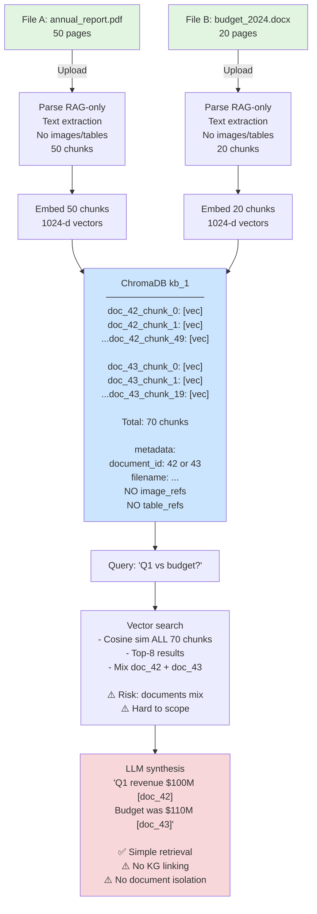

---

### Mode 2: Multi-File Pure GraphRAG

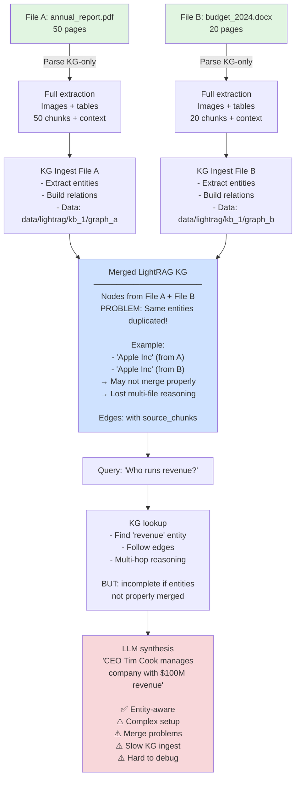

---

### Mode 3: Multi-File Hybrid (Best Practice)

```mermaid
graph TD
    FileA3["File A: annual_report.pdf<br/>50 pages"]
    FileB3["File B: budget_2024.docx<br/>20 pages"]

    FileA3 -->|Full parse| Parse_A["Extract all<br/>- Text + structure<br/>- Images + captions<br/>- Tables + summaries<br/>50 chunks"]

    FileB3 -->|Full parse| Parse_B["Extract all<br/>- Text + structure<br/>- Images + captions<br/>- Tables + summaries<br/>20 chunks"]

    Parse_A --> Index_A["🔄 Parallel Index<br/>A. Embed (1024-d)<br/>B. KG ingest"]

    Parse_B --> Index_B["🔄 Parallel Index<br/>A. Embed (1024-d)<br/>B. KG ingest"]

    Index_A -->|Vector| ChromaDB_Hybrid["💾 ChromaDB kb_1<br/>──────────────────<br/>doc_42_chunk_0..49: vectors<br/>doc_43_chunk_0..19: vectors<br/><br/>metadata per chunk:<br/>  document_id: 42 or 43 ✓<br/>  filename: annual_report... ✓<br/>  page_no: 5, 12, ... ✓<br/>  heading_path: [F,R] ✓<br/>  image_refs: [img_001] ✓<br/>  table_refs: [tbl_001] ✓<br/>  year: 2024 ✓"]

    Index_B -->|Vector| ChromaDB_Hybrid

    Index_A -->|KG| KG_Hybrid["🧠 LightRAG kb_1<br/>──────────────────<br/>Merged graph from A & B<br/>Entities properly linked:<br/>  • 'Apple Inc' → single node<br/>  • Edges track source_chunks<br/>  • 'Apple Inc' from A & B<br/>    linked with back-refs"]

    Index_B -->|KG| KG_Hybrid

    ChromaDB_Hybrid --> Query_Hybrid["🔍 Query<br/>'Compare Q1 actual vs<br/>budgeted revenue by region'"]

    KG_Hybrid --> Query_Hybrid

    Query_Hybrid --> Parallel_Ret["🔄 PARALLEL RETRIEVAL"]

    Parallel_Ret -->|A| Vec_Ret["Vector Search<br/>- Embed query (1024-d)<br/>- Search ALL 70 chunks<br/>- Cosine top-20<br/>Result: [chunk_42_0,<br/>chunk_43_2, ...]"]

    Parallel_Ret -->|B| KG_Ret["KG Multi-Hop<br/>- Parse: revenue, Q1,<br/>  region, actual, budget<br/>- Multi-hop paths<br/>Result: [chunk_42_5,<br/>chunk_43_3, ...]"]

    Vec_Ret --> Merge_Hybrid["Merge ~30 unique chunks<br/>(dedup by chunk_id)"]

    KG_Ret --> Merge_Hybrid

    Merge_Hybrid --> Scope_Option["⚙️ OPTIONAL: Scope<br/>User can pre-filter:<br/><br/>Scope: All (default)<br/> → Search 70 chunks<br/><br/>Scope: File A only<br/> → metadata_filter: doc_id=42<br/> → Search 50 chunks<br/><br/>Scope: By tag<br/> → metadata_filter: year=2024<br/> → Search matching chunks"]

    Scope_Option --> Rerank_Hybrid["🎯 Rerank Top-8<br/>Cross-encoder scores<br/>- chunk_42_0: 0.93 ✓<br/>- chunk_43_2: 0.91 ✓<br/>- chunk_42_5: 0.88 ✓<br/>- chunk_43_3: 0.87 ✓<br/>- (4 more)"]

    Rerank_Hybrid --> Retrieve_Hybrid["📦 Top-8 Retrieved<br/>┌─ doc_42, page 5<br/>│  'Q1 revenue $100M' [a3z1]<br/>├─ doc_43, page 2<br/>│  'Q1 budget $110M' [b7w2]<br/>├─ doc_42, page 12<br/>│  'APAC $50M, EMEA $30M' [a3z3]<br/>└─ doc_43, page 1<br/>   'Budget strategy' [b7w4]<br/><br/>All with source tracking<br/>All with relevance scores"]

    Retrieve_Hybrid --> LLM_Hybrid["🤖 LLM Synthesis<br/><br/>Input: top-8 chunks +<br/>      full context +<br/>      conversation history<br/><br/>Directive: cite sources,<br/>max 3 cites/sentence<br/><br/>Output:"]

    LLM_Hybrid --> Answer_Hybrid["Answer:<br/><br/>'Q1 comparison - actual vs budget:<br/><br/>Actual (from annual_report [a3z1]):<br/>$100M total, +15% from Q4<br/>  • APAC: $50M (↑20%) [a3z3]<br/>  • EMEA: $30M (↑10%) [a3z3]<br/><br/>Budgeted (from budget_2024 [b7w2]):<br/>$110M strategic allocation<br/>  • Conservative vs upside [b7w4]<br/><br/>Analysis: $10M under budget<br/>but strategic alignment good [b7w4]<br/><br/>✅ FULL CITATIONS<br/>✅ CLEAR SOURCES<br/>✅ PROVENANCE VISIBLE<br/>✅ SAFE MULTI-FILE<br/>✅ HYBRID REASONING"]

    Answer_Hybrid --> Frontend["🎯 Frontend Display<br/><br/>Answer with badges:<br/>'$100M [a3z1]'<br/>'APAC: $50M [a3z3]'<br/><br/>Hover [a3z1]:<br/>Source card shows<br/>  annual_report.pdf<br/>  page 5<br/>  Financial Results<br/>  Relevance: 0.93<br/>  'Q1 revenue $100M...'<br/><br/>Click [a3z1]:<br/>  Jump to doc viewer<br/>  Page 5, section highlighted"]

    style FileA3 fill:#e1f5e1
    style FileB3 fill:#e1f5e1
    style Parse_A fill:#d4edda
    style Parse_B fill:#d4edda
    style ChromaDB_Hybrid fill:#cce5ff
    style KG_Hybrid fill:#cfe2ff
    style Parallel_Ret fill:#fff3cd
    style Rerank_Hybrid fill:#cfe2ff
    style Answer_Hybrid fill:#d4edda
    style Frontend fill:#e8f5e9
```

---

## 3️⃣ CONFIGURATION COMPARISON

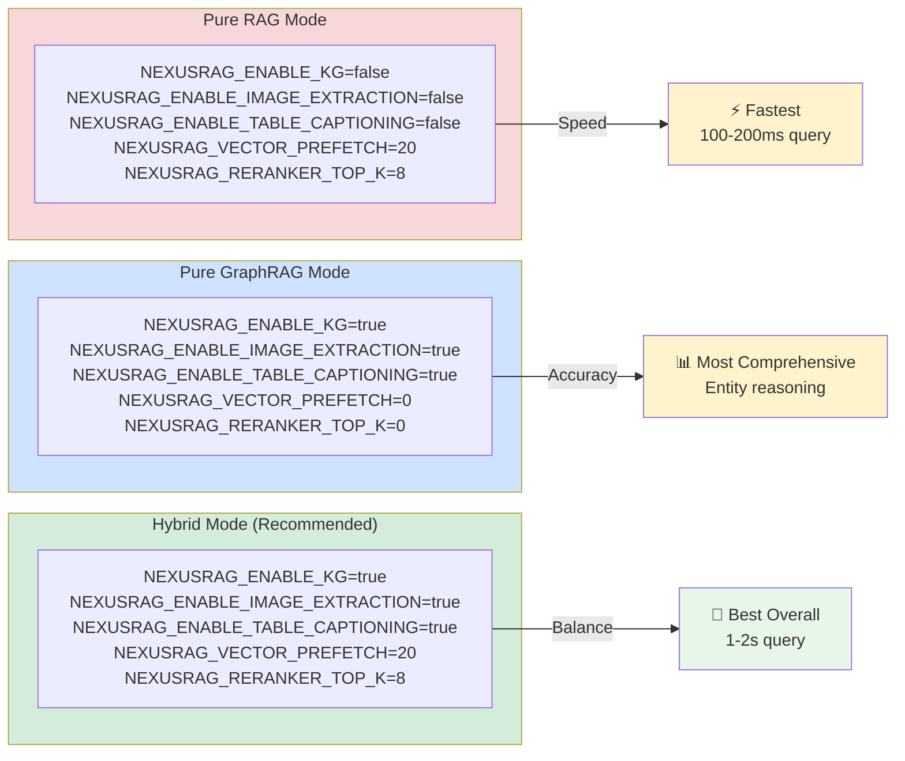

---

## 4️⃣ QUERY COMPARISON TABLE

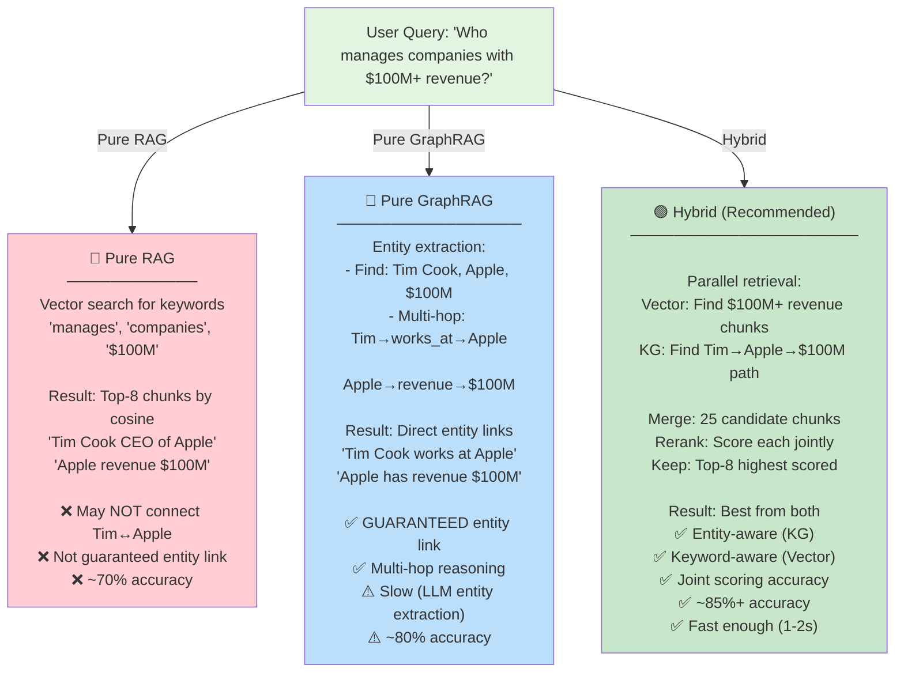

---

## 5️⃣ COMPLETE DECISION TREE

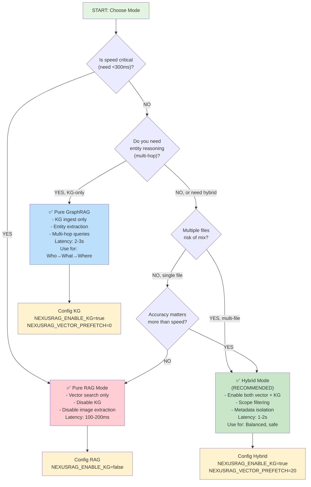

---

## 6️⃣ PERFORMANCE METRICS TABLE

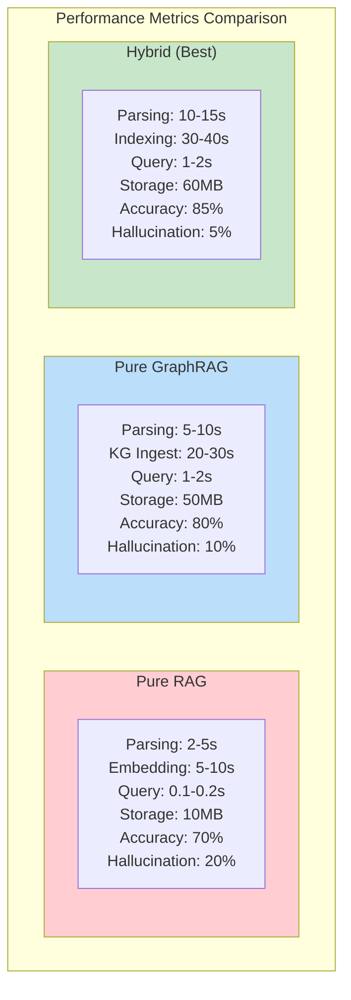

---

## 7️⃣ REAL EXAMPLE: Multi-File Hybrid Query

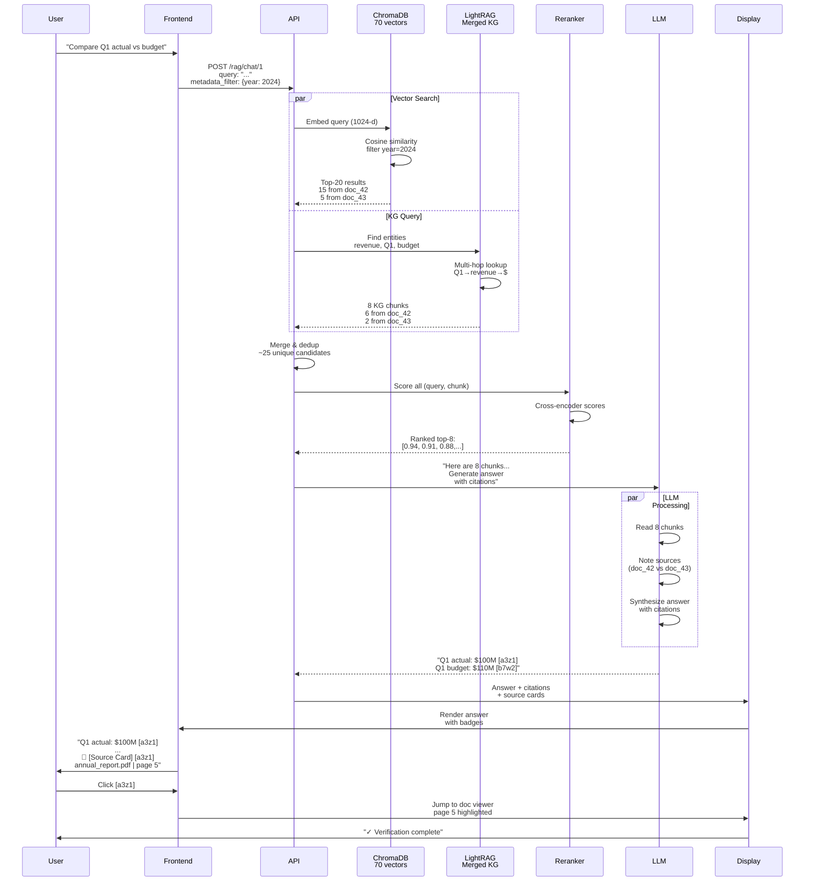

---

## 8️⃣ ENV CONFIGURATION PRESETS

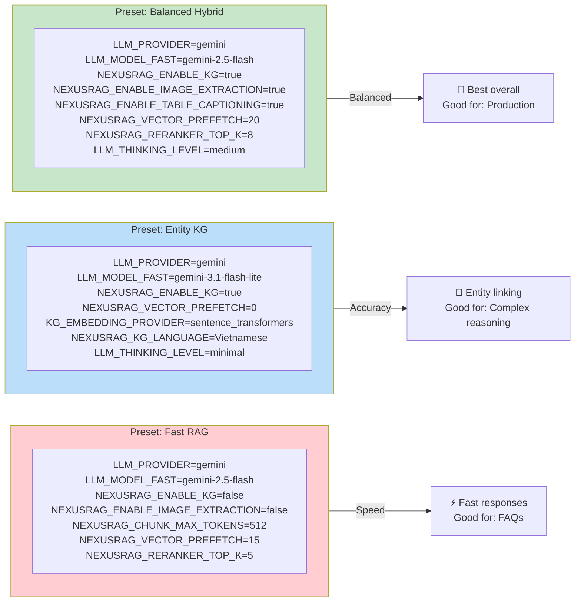

---

## 9️⃣ SINGLE FILE → MULTI FILE MIGRATION

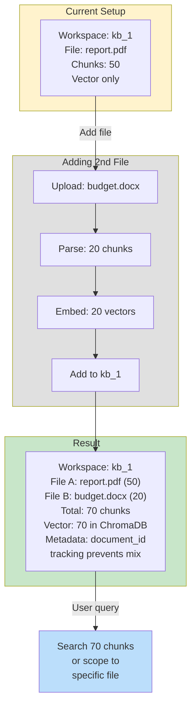

---

**Ready to use!** Copy any diagram above into a Mermaid editor for rendering.
