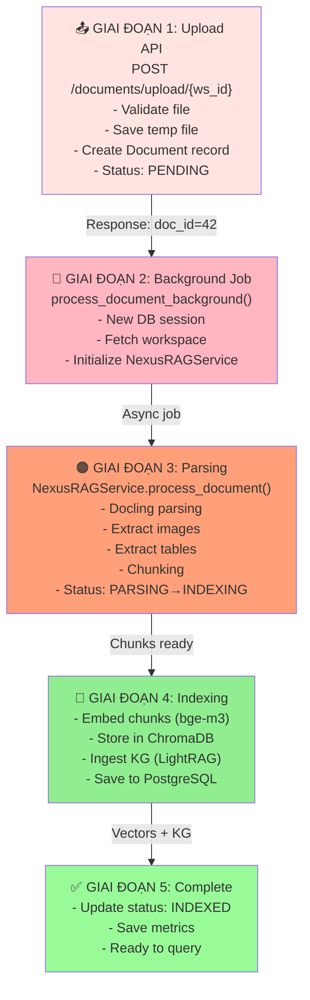
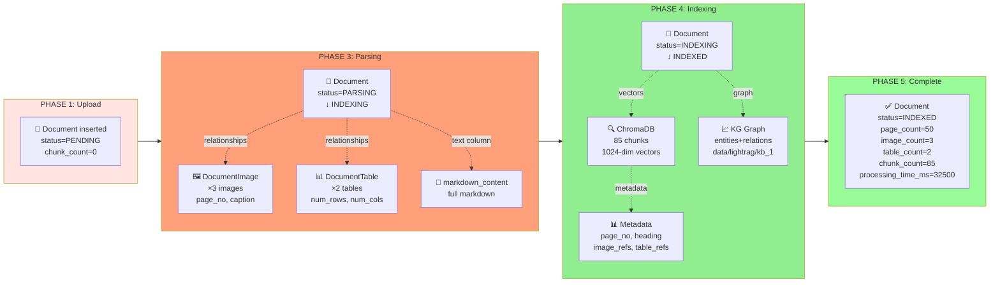
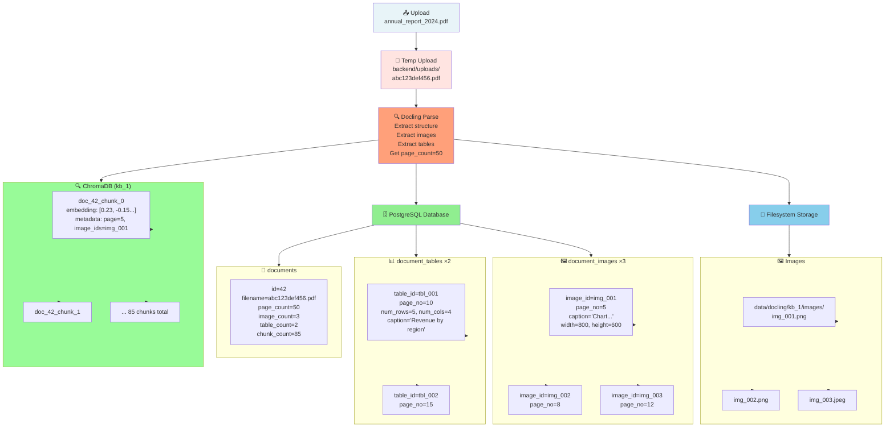
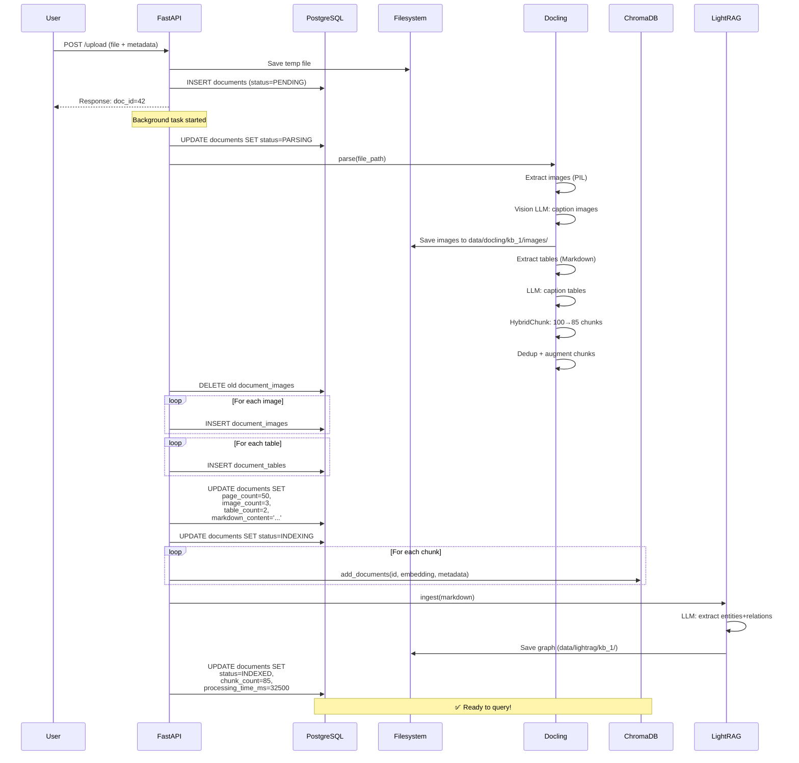
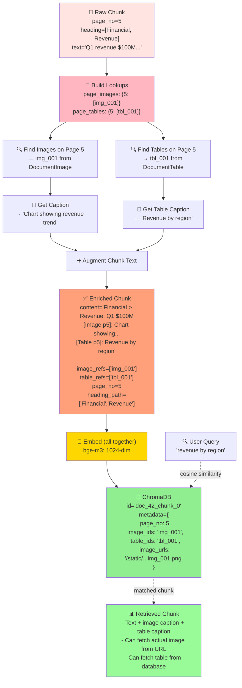
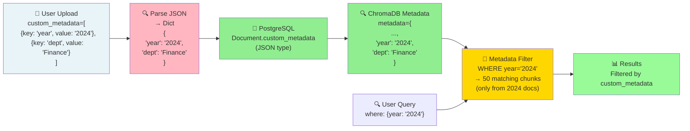

# Biểu Đồ Upload Process Chi Tiết

## Diagram 1: 5 Giai Đoạn Overview



## Diagram 2: Database Schema — Upload After Each Phase



## Diagram 3: File Storage Architecture



## Diagram 4: Data Flow — From File to Query-Ready

```mermaid
graph LR
    File["📄 PDF<br/>5MB"]

    API["FastAPI<br/>upload_document()"]

    Validate["✓ Validate<br/>ext, size<br/>workspace"]

    SaveTemp["💾 Save Temp<br/>uploads/abc123.pdf"]

    CreateDB["🗄️ Create Record<br/>Document(status=PENDING)"]

    BGTask["🔄 Background Task<br/>process_document()"]

    Docling["🔍 Docling Parser<br/>DocumentConverter"]

    Extract["📊 Extract<br/>Images, Tables<br/>Markdown, Pages"]

    subgraph ExtractDetail["Extract Results"]
        Pages["Pages: 50"]
        Imgs["Images: 3<br/>with captions"]
        Tbls["Tables: 2<br/>with captions"]
    end

    SaveExtracted["💾 Save Extracted<br/>DB + Filesystem"]

    Chunk["🔗 Chunking<br/>HybridChunker<br/>→ 85 chunks"]

    Augment["➕ Augment<br/>+ image captions<br/>+ table captions<br/>+ heading path"]

    Embed["🔢 Embed<br/>bge-m3<br/>→ 1024-dim"]

    Vector["💾 Store Vectors<br/>ChromaDB<br/>kb_1 collection"]

    KG["📈 KG Ingest<br/>LightRAG<br/>Entity extraction"]

    Complete["✅ Complete<br/>Document.status<br/>= INDEXED"]

    Ready["🚀 Ready to Query!"]

    File --> API
    API --> Validate
    Validate --> SaveTemp
    SaveTemp --> CreateDB
    CreateDB -->|Response| BGTask

    BGTask --> Docling
    Docling --> Extract
    Extract --> ExtractDetail
    ExtractDetail --> Pages
    ExtractDetail --> Imgs
    ExtractDetail --> Tbls

    Extract --> SaveExtracted
    SaveExtracted -->|Document.page_count=50<br/>Document.image_count=3<br/>Document.table_count=2| Chunk

    Chunk --> Augment
    Augment --> Embed
    Embed --> Vector
    Extract --> KG

    Vector --> Complete
    KG --> Complete
    Complete --> Ready

    style File fill:#E8F4F8
    style API fill:#FFE4E1
    style BGTask fill:#FFA07A
    style Docling fill:#FFB6C1
    style ExtractDetail fill:#FFA500
    style Embed fill:#FFD700
    style Vector fill:#90EE90
    style KG fill:#90EE90
    style Complete fill:#98FB98
    style Ready fill:#00FF00
```



## Diagram 5: Database Operations — Sequence Diagram



## Diagram 6: Docling Parsing — Detail

```mermaid
graph TD
    File["📄 Input File<br/>annual_report_2024.pdf"]

    DC["🔍 DocumentConverter<br/>Docling initialization"]

    Convert["🔄 Convert<br/>conv_result = converter.convert(file)"]

    Doc["📋 Docling Document<br/>doc = conv_result.document"]

    subgraph DocProps["Document Properties"]
        Pages["doc.pages<br/>→ page_count=50"]
        Children["doc.children<br/>→ blocks"]
        Meta["doc.metadata"]
    end

    Iterate["🔁 Iterate doc.pages"]

    subgraph PageContent["Per Page:"]
        Pic["Pictures/Images<br/>→ PIL Image"]
        Txt["Text blocks<br/>→ Markdown"]
        Tbl["Tables<br/>→ Markdown"]
        Heading["Headings<br/>→ hierarchy"]
    end

    VisionLLM["👁️ Vision LLM<br/>Gemini/Ollama<br/>caption_image()"]

    TextLLM["🔤 LLM<br/>caption_table()"]

    Extract["✅ Extract:<br/>- Images: 3<br/>- Tables: 2<br/>- page_count: 50"]

    Export["📝 Export Markdown<br/>doc.export_to_markdown()"]

    InjectRefs["➕ Inject references<br/>- Image URLs<br/>- Table captions"]

    Chunk["🔗 Chunking<br/>HybridChunker<br/>max_tokens=512"]

    Result["📦 ParsedDocument"]

    File --> DC
    DC --> Convert
    Convert --> Doc
    Doc --> DocProps

    Pages -.->|len(doc.pages)| Iterate
    Children -.->|iterate| Iterate

    Iterate --> PageContent
    PageContent --> Pic
    PageContent --> Txt
    PageContent --> Tbl
    PageContent --> Heading

    Pic --> VisionLLM
    VisionLLM -->|"[Image]: Chart showing..."| Extract

    Tbl --> TextLLM
    TextLLM -->|"[Table]: Revenue summary"| Extract

    Extract --> Export
    Export --> InjectRefs
    InjectRefs --> Chunk
    Chunk --> Result

    Result -->|markdown<br/>chunks<br/>images<br/>tables<br/>page_count| RES["ParsedDocument object"]

    style File fill:#E8F4F8
    style DC fill:#FFB6C1
    style DocProps fill:#FFA500
    style VisionLLM fill:#FFD700
    style TextLLM fill:#FFD700
    style Extract fill:#90EE90
    style Result fill:#98FB98
```

## Diagram 7: Chunk Augmentation — How Images/Tables Stay With Chunks



## Diagram 8: Timeline — Processing Durations

```mermaid
gantt
    title Document Upload Processing Timeline

    section Upload
    API Receive:api1, 0, 1s
    File Validation:api2, 1s, 1s
    File Save:api3, 2s, 0s
    DB Record Insert:api4, 2s, 1s
    Response to User:crit, api5, 3s, 0s

    section Background (Async)
    Background Job Starts:bg1, 4s, 1s
    Docling Parse:parse1, 5s, 8s
    Extract Images:parse2, 5s, 5s
    Image Captioning (LLM):parse3, 10s, 4s
    Extract Tables:parse2, 5s, 3s
    Table Captioning (LLM):parse4, 8s, 3s
    Chunking:chunk1, 13s, 1s
    Deduplication:chunk2, 14s, 1s
    DB Save:db1, 15s, 2s

    section Indexing
    Embedding (bge-m3):embed1, 17s, 5s
    ChromaDB Store:vec1, 22s, 2s
    KG Ingest:kg1, 17s, 10s
    Final DB Update:db2, 27s, 1s
    Complete:crit, end1, 28s, 0s

    section State
    PENDING:state1, 0s, 3s
    PARSING:state2, 3s, 15s
    INDEXING:state3, 18s, 10s
    INDEXED:crit, state4, 28s, 2s
    Ready to Query:state5, 30s, 1s
```

## Diagram 9: Custom Metadata Flow


